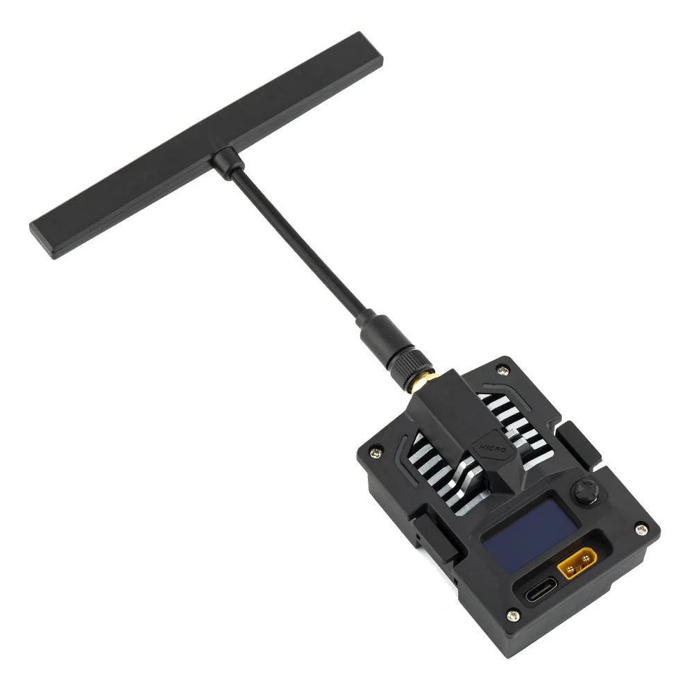
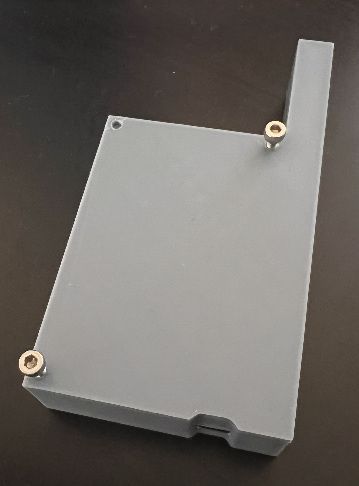

# Ground-Station-and-Payload-2025

Ground Station for Rocketry At Virginia Tech for the IREC 2025 competition.

## About

This repository contains the code for the ground station and payload systems for Rocketry At Virginia Techs's IREC 2025 competition. The system is designed to collect telemetry data from the rocket payload and lower half in the Active Drag System section.

It utilizes multiple ESP32 boards for LoRa communication, a Raspberry Pi Pico for sensor data collection, and an iOS app for displaying telemetry data.

You can find the iOS app here: [https://github.com/RocketryVT/Rocket-Tracker](https://github.com/RocketryVT/Rocket-Tracker)

Software wise, this is 100% Rust + Embassy + no_std.

## Findings

While Rust and the Embassy framework seems promissing, overall HAL quality is not completely there yet. Often dependency version mismactch or missing/differing implementations of the same HAL trait across different boards caused lots of issues and confusion. This is especially true for the ESP32 boards, where the bluetooth stack is not fully implemented yet and often caused panics when trying to use it. UART for ESP32 boards also is not stable and limited how fast we could transmit data from the payload to the tracker.

However on some specific positive notes, the Cargo ecosystem and build system is very nice to use, and the Embassy project/embedded-hal have lots of potential. Unlike C++, Rust's Cargo system is easier to use than git submodules or CMake's FetchContent. While Conan, vcpkg, Bazel, and other C++ package managers exist, they are not as widely adopted and have their own issues. The Rust community is also very welcoming and helpful, making it easy to get started. Embassy allowed us to use a lot of the same or similar APIs across different boards, making it easier to port code between them. The async/await model is also very nice to use and makes writing asynchronous code much easier.

For anyone looking into using Rust, understand that the coummnity is still small and making large sweeping changes every day. Beyond simple Rust issues, you will likely run into issues with the Embassy framework and the HALs for the specific boards you are using. While the Rust Embedded community is working hard to improve the situation, they aren't able to hand hold you through every issue you will run into. Also just use the `main` branch on anything Embassy related; solves a lot of issues.

Before setting out on using Rust we looked at Zig, FreeRTOS, Zephyr, and NUTTX. At the time, the ADS did not use FreeRTOS and we wanted to try something new that would allow us to have a very easy way to share code against many different boards without using Arduino or Platformio. Eventually we ported the ADS code from just Pico-SDK to FreeRTOS which was a much better experience. Zephyr and NUTTX have a mucher steeper learning curve and were not required for our use case. Zig is in a much worse state than Rust when it comes to the ecosystem. We expect in the near future that Rust and Zig will be competing for the same space in embedded development.
Again because of using many different boards we initially thought that Rust would be an easier choice than FreeRTOS.

One concern/issue with Embassy is that Embassy does not and will never support soft-hard timings. You may call `Timer::after_millis(500).await;` but the task rate is not guaranteed to be 1000hz even if the hardware can support it. Even if you call a much lower rate, the task may still not run at the requested rate. It will however run at a faster rate, so while you can request 1000hz you may get 1300hz.

Because of this, going forward we will be moving to C++ and FreeRTOS similar to how the Active Drag System (ADS) was implemented this year. We plan on unifying the ADS, Payload, and Tracker code into a single C++ codebase and the physical PCB's that can be used across all boards as we will exclusivly be using only one microcontroller for all projects. This negates the inital desire to use Rust to share code across multiple boards/archetypes.

While we are moving away from Rust, we still think it has a lot of potential and will continue to use it for other personal projects. We hope that the Rust Embedded community will continue to improve the situation and make it easier to use Rust for embedded development.

## Getting Started

### Dependencies

- Rust
- Protobuf compiler (`protoc`)
- Swift Protobuf SDK [Apple Protbuf](https://github.com/apple/swift-protobuf)

To install Rust, follow the instructions at [rustup.rs](https://rustup.rs/).

That's it!

### Clone

```shell
git clone https://github.com/RocketryVT/Ground-Station-and-Payload-2025.git
cd Ground-Station-and-Payload-2025/
```

### Some Notes

This repository contains the .proto file for sending data over bluetooth, you have to use `protoc --swift_out=. src/data.proto` to generate the Swift file for the iOS app. Once generated the swift file should be placed in the `Rocket-Tracker/RocketTracker/Models/` directory.

Rust/Embassy's bluetooth stack [TrouBLE](https://github.com/embassy-rs/trouble) is not super stable at the moment and required locking some dependencies to specific git commits.

### Main files

- [esp32/src/bin/tracker.rs](esp32/src/bin/tracker.rs): This is designed to run on the RadioMaster Bandit Micro ExpressLRS 915MHz, it sends the recieved telemetry data over bluetooth to our iOS app.

- [esp32s3/src/bin/top.rs](esp32s3/src/bin/top.rs): This is designed to run on the Heltec WiFi LoRa 32(V3), recieves sensor data from the pico on the payload and sends it over LoRa to the tracker.
- [esp32s3/src/bin/bottom.rs](esp32s3/src/bin/bottom.rs): This is designed to run on the Heltec WiFi LoRa 32(V3), recieves GPS data from a Ublox M9N Neo and sends it over LoRa to the tracker. It is located on the bottom half of the rocket in the same area as the the Active Drag System. It connects to one GPS and one 915Mhz LoRa that are mounted onto the carbon fiber booster section.
- [esp32s3/src/bin/tracker.rs](esp32s3/src/bin/tracker.rs): This is designed to run on the Heltec WiFi LoRa 32(V3), it sends the recieved telemetry data over bluetooth to our iOS app.

- [pico/src/payload.rs](pico/src/main.rs): This is designed to run on the Raspberry Pi Pico, it collects sensor data from our various sensors and sends them over UART to the `top` esp32s3 board which then sends it over LoRa to the tracker.

### Sensors

- [libs/ADXL375](libs/ADXL375/src/lib.rs): ±200g 3-axis accelerometer.
- [libs/ISM330DHCX](libs/ISM330DHCX/src/lib.rs): ±4g 3-axis accelerometer and 3-axis gyroscope.
- [libs/LSM6DSO32](libs/LSM6DSO32/src/lib.rs): ±32g 3-axis accelerometer and 3-axis gyroscope.
- [BMP390 https://github.com/asasine/bmp390](https://github.com/asasine/bmp390): Pressure sensor for altitude.
- [https://github.com/ublox-rs/ublox](https://github.com/ublox-rs/ublox): Parses UBX packets from the Ublox M9N Neo GPS module.
- [libs/UBLOX-rs](libs/UBLOX-rs/src/lib.rs): Utility library for setting up the Ublox M9N Neo GPS module.

### Other

- [libs/Mesh](libs/Mesh/src/protocol/mod.rs): Contains all the data structures for the telemetry data sent over LoRa.